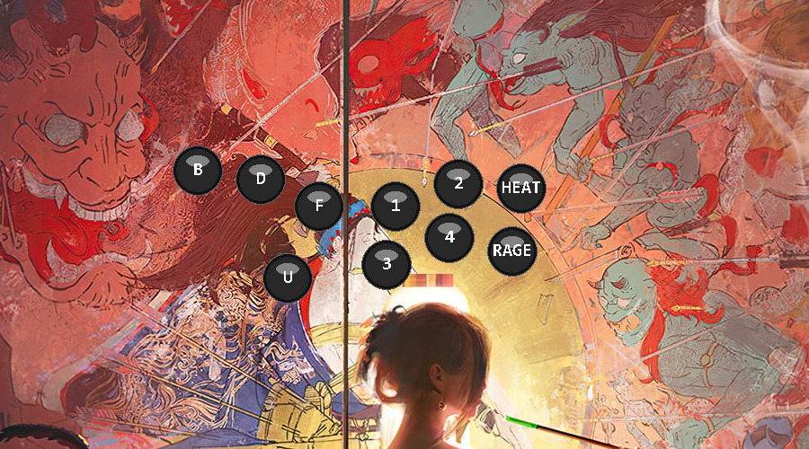

# HitGlow

Overlay desktop Windows qui affiche en temps reel les inputs d'une manette
leverless (Haute42 sous GP2040-CE, vue comme un pad standard) — pense pour
le stream Tekken 8 capture avec OBS. Fenetre de parametrage graphique
integree : aucun fichier a editer a la main.



## Fonctionnalites

**Overlay**
- Fenetre sans bordure, toujours au-dessus, deplacable au clic-glisser,
  redimensionnable a la molette (position/taille sauvegardees automatiquement).
- Vraie transparence Windows par pixel (pas besoin de filtre chroma key
  dans OBS dans le cas general) — avec un mode de repli fond uni magenta
  configurable si ta methode de capture OBS ne gere pas bien l'alpha.
- Bloc directions (gauche) : Gauche / Bas / Droite alignes + Haut decale
  en dessous (position pouce), en cyan.
- Bloc actions (droite) : 6 ronds en quinconce façon hitbox — `1`, `2`,
  `3`, `4` (attaques) + `HEAT`, `RAGE`, rangee haute en jaune, rangee
  basse en rouge. Labels renommables, police configurable.
- Fondu de couleur configurable a l'extinction d'un bouton.
- Fonctionne en arriere-plan : les inputs sont lus meme quand le jeu ou
  OBS ont le focus, pas HitGlow.
- Icone dans la zone de notification (system tray) **et** bouton
  "Masquer l'overlay" dans la fenetre de parametrage : deux façons
  d'afficher/masquer l'overlay sans le fermer — pratique car il reste
  toujours au-dessus, ce qui peut gener hors stream.

**Combo trainer**
- Fenetre separee (transparente, deplacable) qui affiche un combo sous
  forme de ronds colores façon notation Tekken 8, et suit ta progression
  en direct via tes vrais inputs (manette et/ou clavier).
- Les combos se creent en collant une notation (ex: `f+3,1 ⏵ df+1 ⏵ f+2,2`)
  dans l'onglet **Combos** de la fenetre de parametrage — HitGlow detecte
  automatiquement les parties qu'il peut suivre en direct (chiffres,
  directions y compris diagonales) et affiche le reste (noms de stance,
  annotations specifiques a un personnage) comme repere a valider soi-meme
  (barre Espace).
- Combos ranges par jeu et personnage (regroupement insensible a la
  casse) sous forme de menus deroulants repliables — clique sur "Tekken 8"
  ou sur un personnage pour reduire/deployer sa liste, pratique quand elle
  grandit.
- Le bouton "S'entrainer" devient "Arreter l'entrainement" tant que le
  trainer tourne — pas besoin d'aller fermer sa fenetre a la main.
- Touches en jeu : `R` pour recommencer, `Espace` pour valider une etape
  manuelle, `Echap` pour fermer. Le combo se relance automatiquement une
  fois termine (entrainement en boucle).

**Fenetre de parametrage**
- Mapping par detection : clique "Detecter", appuie sur l'input physique
  (manette ou clavier), c'est mappe. Aucun index a chercher/lire soi-meme.
- Apercu en direct : un panneau reagit immediatement a tes appuis pour
  verifier que le mapping et les couleurs sont corrects, sans lancer
  l'overlay.
- Manette **ou clavier** comme source d'input, y compris un melange des
  deux (ex : directions a la manette, une action au clavier).
- Couleurs, transparence, duree de fondu et police entierement
  configurables depuis l'interface.
- Aide OBS integree (onglet dedie).
- Verification de mise a jour au demarrage (et a la demande) contre les
  releases GitHub : une bannière propose une mise a jour en un clic si une
  nouvelle version est disponible. **Mettre a jour** telecharge le nouvel
  installeur, le lance, puis ferme HitGlow (overlay et trainer compris)
  pour laisser l'installeur remplacer les fichiers — comme la plupart des
  logiciels. Un lien "Page de la release" reste disponible pour un
  telechargement manuel.

## Prerequis

- Windows 10 (1903+) ou Windows 11.
- Une manette leverless (ou un clavier, si tu veux jouer sans manette) —
  branchee et reconnue par Windows si tu utilises une manette.

## Installation

### Option 1 — Installeur (recommande)

Telecharge **[HitGlow-Setup.exe](https://github.com/Khatoonn/HitGlow/releases/latest/download/HitGlow-Setup.exe)**
et lance-le. Installation par utilisateur, sans droits administrateur,
avec raccourci menu Demarrer et desinstalleur.

Une version portable (sans installation) est aussi disponible :
**[HitGlow.exe](https://github.com/Khatoonn/HitGlow/releases/latest/download/HitGlow.exe)**.

Toutes les versions : [releases GitHub](https://github.com/Khatoonn/HitGlow/releases).

### Option 2 — Depuis les sources

```bash
git clone https://github.com/Khatoonn/HitGlow.git
cd HitGlow
python -m venv .venv
.venv\Scripts\pip install -r requirements.txt
```

## Lancement

Depuis les sources :

```bash
.venv\Scripts\python run_hitglow.py
```

Ceci ouvre la fenetre de parametrage. Le bouton **Lancer l'overlay** en
bas demarre la fenetre transparente separement — tu peux fermer les
parametres, l'overlay continue de tourner.

## Mapping (manette et/ou clavier)

Tout se fait depuis la fenetre de parametrage, onglet **Mapping** :

1. Choisis le peripherique en haut (**Manette** detectee, ou **Clavier**).
2. Pour chaque direction/action, clique **Detecter** puis appuie sur
   l'input physique correspondant (bouton, gachette, D-pad, ou touche
   clavier selon le peripherique choisi). Le mapping se remplit tout seul.
3. Renomme le nom affiche sur chaque rond directement dans le champ texte
   a cote (ex : remplacer `HEAT` par autre chose).
4. Regarde le panneau **Apercu en direct** a droite : appuie sur tes
   inputs pour verifier que les bons ronds s'allument, avec les bonnes
   couleurs.

Les gachettes analogiques (LT/RT, souvent utilisees pour un Rage Art) sont
geres comme les boutons digitaux — la detection s'en occupe automatiquement.

## Apparence

Onglet **Apparence** : couleurs (eteint, directions, rangee haute, rangee
basse, texte), fond de repli (chroma key), duree du fondu, police des
labels (liste des polices systeme, ou fichier `.ttf`/`.otf` personnalise).

## Combo trainer

Onglet **Combos** de la fenetre de parametrage :

1. Renseigne le personnage et un nom pour le combo.
2. Colle la notation dans le champ texte (depuis une doc/tableur de
   combos, ex: `f+3,1 ⏵ df+1,[ 2~1 ] ⏵ f+2,2 ⏵ 3,1,2`). Les virgules et
   fleches (`⏵`, `→`, `->`) separent les etapes.
3. Clique **Apercu** pour voir combien d'etapes seront suivies
   automatiquement (chiffres/directions) vs a valider soi-meme (noms de
   stance, conditions type `CH`/`ws`/`heat on`, annotations `T!`/`~X`).
4. **Enregistrer** puis **S'entrainer** : une fenetre transparente separee
   s'ouvre, affiche le combo en ronds colores et avance automatiquement
   quand tu presses les bons inputs, dans l'ordre (pas de fenetre de
   timing — c'est un outil pour memoriser l'enchainement, pas un juge de
   precision frame par frame).

Dans le trainer : `R` pour recommencer, `Espace` pour valider une etape a
faire soi-meme, `Echap` pour fermer. Le combo boucle automatiquement une
fois termine.

## Integration OBS

Voir aussi l'onglet **Aide OBS** dans l'application.

1. Clique **Lancer l'overlay**, positionne-le et redimensionne-le sur
   ton bureau (clic-glisser pour deplacer, molette pour redimensionner).
2. Dans OBS, ajoute une source **Capture de fenetre** (Window Capture),
   cible la fenetre `HitGlow`.
   - Methode de capture recommandee : **Windows 10 (1903 et plus)**
     (Windows Graphics Capture) — c'est celle qui restitue correctement
     la transparence par pixel de la fenetre.
3. Si la fenetre apparait opaque/noire dans OBS malgre tout : decoche
   **Transparence reelle** dans l'onglet Apparence. HitGlow bascule alors
   sur un fond magenta uni (`#FF00FF`) — ajoute un filtre **Incrustation
   couleur** (Chroma Key) sur la source dans OBS, cible le magenta.

## Build en .exe

```bash
.venv\Scripts\pip install pyinstaller
.venv\Scripts\pyinstaller --onefile --noconsole --name HitGlow --paths src --collect-all customtkinter run_hitglow.py
```

L'executable est genere dans `dist/HitGlow.exe`. `--collect-all customtkinter`
est necessaire pour embarquer les fichiers de theme de l'interface.

## Build de l'installeur (Inno Setup)

1. Installe [Inno Setup](https://jrsoftware.org/isinfo.php) (gratuit).
2. Build d'abord `dist/HitGlow.exe` (etape precedente).
3. Compile le script :

```bash
"C:\Program Files (x86)\Inno Setup 6\ISCC.exe" installer\HitGlow.iss
```

L'installeur est genere dans `dist_installer/HitGlow-Setup.exe`.

## Structure du projet

```
HitGlow/
├── run_hitglow.py            # lanceur : python run_hitglow.py
├── src/hitglow/
│   ├── settings_app.py          # fenetre de parametrage (customtkinter)
│   ├── overlay_main.py          # boucle de l'overlay (mode --overlay)
│   ├── trainer_main.py          # boucle du combo trainer (mode --trainer)
│   ├── settings_store.py        # persistance JSON + logique de mapping/detection
│   ├── combo_store.py           # persistance des combos (combos.json)
│   ├── combo_parser.py          # notation Tekken -> etapes trackables/texte
│   ├── combo_tracker.py         # suivi de progression dans un combo
│   ├── combo_render.py          # rendu de la barre de combo (ronds/icones)
│   ├── input_reader.py          # lecture manette (pygame) et clavier (Win32)
│   ├── overlay_window.py        # fenetre transparente Win32 + rendu
│   ├── tray_icon.py              # icone system tray (afficher/masquer)
│   ├── updater.py                # verification de version via releases GitHub
│   ├── calibration.py           # formatage overlay de calibration (debug)
│   └── layout.py                 # positions/tailles des ronds
├── installer/HitGlow.iss     # script Inno Setup
├── tests/                    # tests de la logique pure (pytest)
├── requirements.txt
├── requirements-dev.txt
├── LICENSE                    # MIT
└── .gitignore
```

## Licence

MIT — voir [LICENSE](LICENSE).
